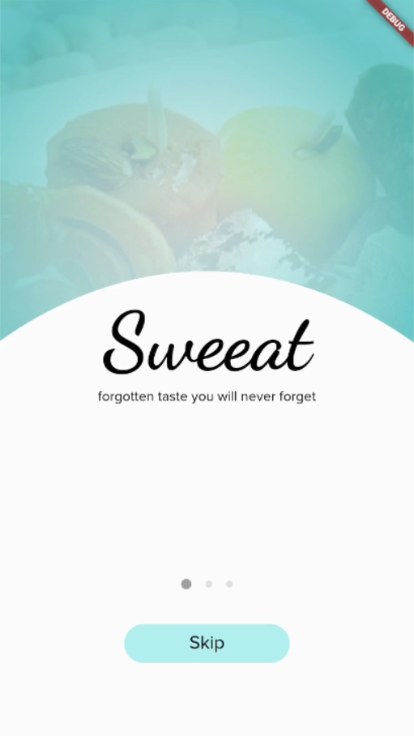

# Project Sweeat

This project is for our Design Engineering subject.

## About

> The aim of this project is to preserve the taste and identity of regional sweets and delicacies. With this platform people can enjoy tastes from different parts of our country, and it will also help indigenous confectioner to boost their business and moral.

## Screenshots

- Home Screen
  

`⚠ NOTE: This project is under development.`
